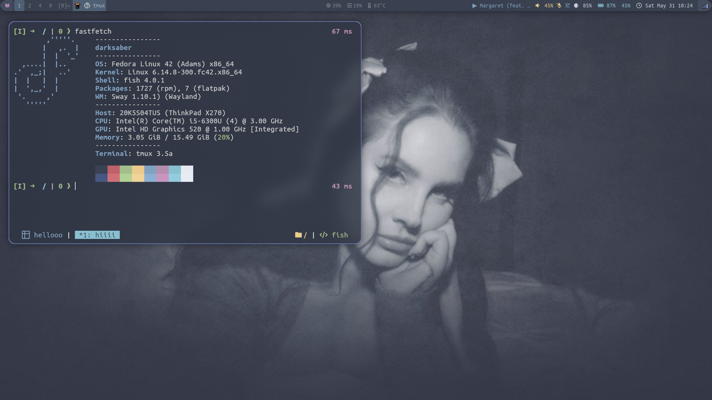
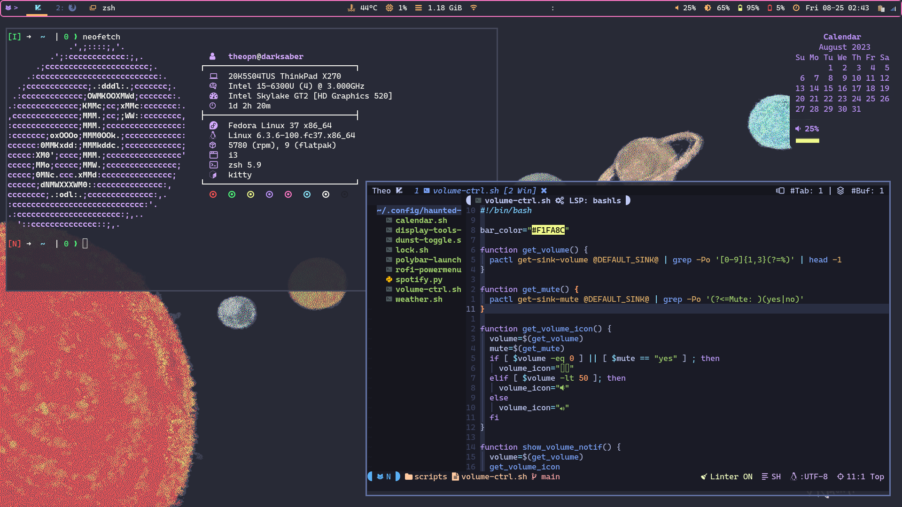

# Haunted Tiles

|  |
| :--:                                                                             |
|                                                  |
|                                                      |

Collection of utilities and scripts for my Sway (Swayfx) and i3 environment in Fedora.

I had an ambitious plan of making this the next best Dracula-themed tiling window manager "distro" (hence the name of the repository), now it is just a minimal Sway/i3 config for my laptop running Fedora.

I usually install Fedora i3-spin and Swayfx on top of it, as Wayland screen sharing is not reliable yet.
Nonetheless, since Sway is my main WM, i3 might lack some features that Sway has.

Credits:

- [Logo](./assets/haunted-tiles-logo.png), Dracula-themed solar system wallpaper: my girlfriend Naomi
- Nord wallpaper:
- Lock icon: [Pixabay](https://pixabay.com/vectors/lock-locked-metal-protection-tool-24269/)

## How I Setup Fedora

- Install i3 spin (check [here](https://docs.fedoraproject.org/en-US/i3/package-groups/) for the complete list of pre-installed packages)
- ~Install Sway spin (check [here](https://gitlab.com/fedora/sigs/sway/sway-config-fedora/-/blob/fedora/sway-config-fedora.spec.rpkg?ref_type=heads) for the complete list of pre-installed packages)~
- Install: `blueman brightnessctl dunst fzf git imagemagick kitty lxpolkit network-manager-applet playerctl vim`
- Install `rofi-wayland` with `--allowerasing` flag if regular `rofi` is already installed
- Install tools for i3: `copyq feh flameshot picom polybar setxkbmap redshift rofi xinput xss-lock`
- Install `swayfx` from Copr (`dnf copr enable swayfx/swayfx`) and install Sway related tools: `clipman gammashift-indicator grimshot waybar wf-recorder`
- Install UbuntuMono Nerd Font:
    ```sh
    mkdir -p ~/.local/share/fonts
    cd ~/.local/share/fonts
    wget -O tmp.zip https://github.com/ryanoasis/nerd-fonts/releases/download/v3.3.0/UbuntuMono.zip
    unzip tmp.zip
    fc-cache -vf
    rm tmp.zip
    cd -
    ```
- Locate the wallpaper as a PNG file at `$XDG_CONFIG_HOME/wallpaper.png`
- Generate a new lock screen image using the included lock icon:
    ```sh
    # use `lock-24269-640.png` for higher resolution image
    magick $XDG_CONFIG_HOME/wallpaper.png $XDG_CONFIG_HOME/haunted-tiles/assets/lock-24269-360.png -gravity center -composite $XDG_CONFIG_HOME/lockscreen.png
    ```
- Finally, clone the repository and run the installation script:
    ```sh
    git clone https://github.com/theopn/haunted-tiles.git ~/.config/haunted-tiles
    ~/.config/haunted-tiles/install.sh
    ```

Post installation

- Add yourself to the `input` user group for Waybar keyboard state module:
    ```sh
    usermod -a -G input [username]
    ```
- Modify the coordinates in the Redshift/Gammastep config
- Install `adobe-source-han-sans-kr-fonts fcitx5 fcitx5-hangul` and set up Korean input with fcitx5
- Install power management tool (`tuned-ppd` or `tlp`) and configure

For other tips on configuring i3/Sway tiling WM, read my [i3-sway-tips repository](https://github.com/theopn/i3-sway-tips) for more information.

## Usage

List of keybindings different from the default i3/Sway:

- `jkl;` -> `hjkl`
- `$mod + h` -> `$mod + z`: toggles hori[z]ontal split
- `$mod + d`: app launcher -> launches Rofi window switcher
- `$mod + Space`: toggles between floating/tiled windows -> launches Rofi drun
- `$mod + b`: toggles between floating/tiled windows
- `$mod + [/]`: moves the current workspace to the monitor to the left/right
- `$mod + Shift + c/r/e`:  toggles the `i3_mode`/`sway_mode`, from which you can choose to reload the config, restart, or exit i3/Sway
    - `$mod + shift + r`: (Sway) toggles `screenrecord mode` to control `wf-recorder`
- `$mod + Shift + m`: launches a Rofi script to control connected outputs
    - (Sway) toggles `monitor_mode`, which you can control outputs
- `$mod + Shift + p`: launches a Rofi menu with power options (lock, suspend, shutdown, etc.)
- `$mod + Shift + s`: launches the screenshot tool (Flamshot)
    - (Sway) toggles `screenshot_mode` which you can choose area, screen, or window capture from Grimshot
- `$mod + Shift + v`: launches the clipboard manager (Copy Qin i3, Clipman in Sway)

`[3]=` indicator in Waybar means that there are 3 windows in the scratchpad.
You can add a window to a scratchpad with `$mod + Shift + -` and cycle through the scratchpad with `$mod + -`.
`[]=` is inspired by the tiling window indicator in the dwm statusbar, which does not make sense in this context, but I thought it looked cute.

## i3 TODO

Features in Sway that are not implemented in i3 ~yet~ (maybe never):

- Color picker
- Screen recording
- Idle action
- Mpris (currently playing) information

Things that are better in i3:

- Clipboard tool with image support
- Compositor: fade animation, opacity for inactive (including the lock screen)
- Screen sharing in Flatpak application

