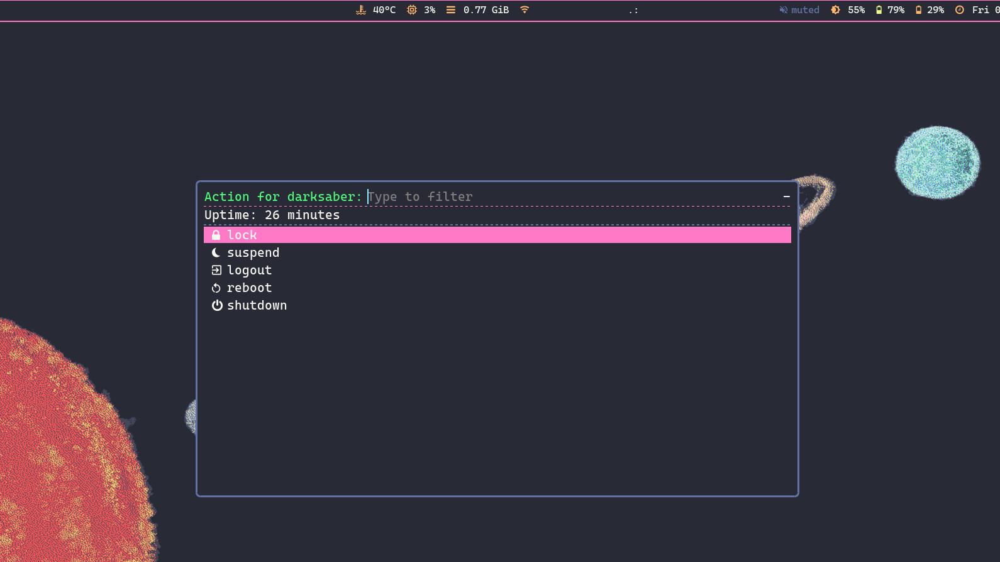
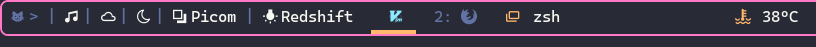

# Haunted-Tiles

|  |
|:--:|
| Cute Logo |
|  |
| i3 |
|  |
| Sway |


Haunted Tiles is my personal i3 WM and Sway setup, along with essential tiling WM tools.
It used to be a part of my [dotfiles repository](https://github.com/theopn/dotfile), and with the growing size of configurations and shared scripts between i3 and Sway, I made a separate repository for it.

- Both X11 and Wayland strive to be a minimal setup that gets out of your way
- The overall theme is [Dracula](https://draculatheme.com/contribute), hence the name "Haunted"-tiles
    - It's also because I like naming everything

## i3 Dependencies

These are packages that get directly called in the i3 config or one of the scripts:

- Brightnessctl: Backlight control
- CopyQ: Clipboard manager
- Dunst: Notification daemon
- Feh: Wallpaper
- Flameshot: Screenshot on X
- i3lock: Simple lock program
- network-manager-applet: GUI network manager
- Picom: Compositor
- Polybar: This is where all the ricing takes place
- Redshift: Blue light filter/nightlight/nightshift
- Rofi: App and custom power menu launcher
- setxkbmap: Swap caps lock and control, your pinky will thank you
- xinput: Enabling trackpad natural scrolling and tap-to-click
- xss-lock: Calling i3lock before suspending

Not necessary but helpful packages:

- Blueman: GUI Bluetooth manager
- Pavucontrol: Volume control for Pulseaudio (or Pipewire that pretends to be Pulseaudio)
- xrandr: External display output control, should be a dependency for X11 server

## Installation

- Installation script will ask you before creating a symlink for each configuration file
- If there is a file/directory in the destination, it will be moved to `~/haunted-tiles.bak`
- **Make sure you have Nerd Font installed!**
    Haunted-tiles uses [CaskaydiaCove Nerd Font](https://www.nerdfonts.com/font-downloads).

```bash
git clone  ~/.config/haunted-tiles
~/.config/haunted-tiles/install.sh
```

## Keybindings

Most of the default i3/Sway keybindings are used. Notable keybindings include:

- `$mod` is the super key
- `$mod + Return`: opens terminal
- `$mod + hjkl`: focuses the left, down, up, or right window
- `$mod + Shift + hjkl`: moves the current window to left, donw, up, or right
- `$mod + f`: toggles the full screen mode
- `$mod + s/w/e`: toggles the stacking, tabbed, or split (tiling) layout
- `$mod + Shift space`: toggles floating mode for the current window
- `$mod + 1-9`: moves to workspace 1 - 9
- `$mod + Shift + 1-9`: moves the current window to workspace 1 - 9
- `$mod + r`: enters the resize mode
- For the complete list of keybindings, reference the config file

List of keybindings differing from the default i3/Sway:

- `jkl;` -> `hjkl`
- `$mod + h` -> `$mod + z`: toggle hori[z]ontal split
- `$mod + Space`: launch Rofi or `sway-launcher-desktop` (you can also use the default `$mod+d`)
- `$mod + Shift + c/r/e`: launch `i3_mode`/`sway_mode`, from which you can choose to reload the config, restart, or exit i3/Sway
- `$mod + Shift + p`: launches a Rofi menu with power options (lock, suspend, shutdown, etc.)
    
- `$mod + Shift + s`: launches the screenshot tool
- `$mod + Shift + v`: shows the clipboard manager

Sway only keybindings:

- `$mod + Shift + Return`: opens floating terminal
- `$mod + Shift + r`: clears clipboard history (it is because there is no "restart" keybinding in Sway)

## Polybar

- Clicking the cat icon in the top left gives you hidden options
    
    - Current Spotify music
    - Weather using `wttr.in`
    - Toggle do not disturb
    - Toggle compositor (Picom)
    - Toggle nightlight (redshift)
- You can mute sound by clicking the volume icon
- You can view the current month's calendar by clicking the date
    - You can view the last month's calendar by right-clicking the date

## Credits

- `./scripts/spotify.py` is heavily based on [polybar-spotify](https://github.com/Jvanrhijn/polybar-spotify/blob/master/spotify_status.py)

