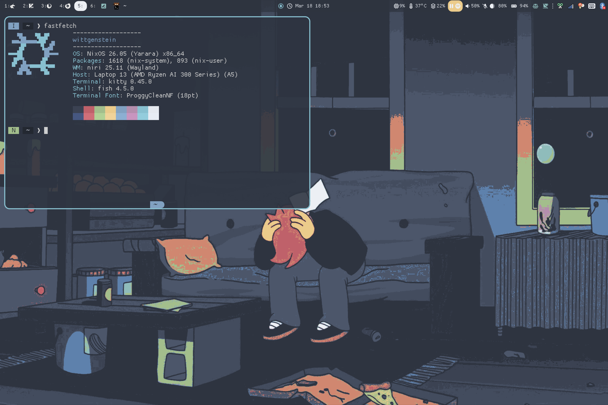
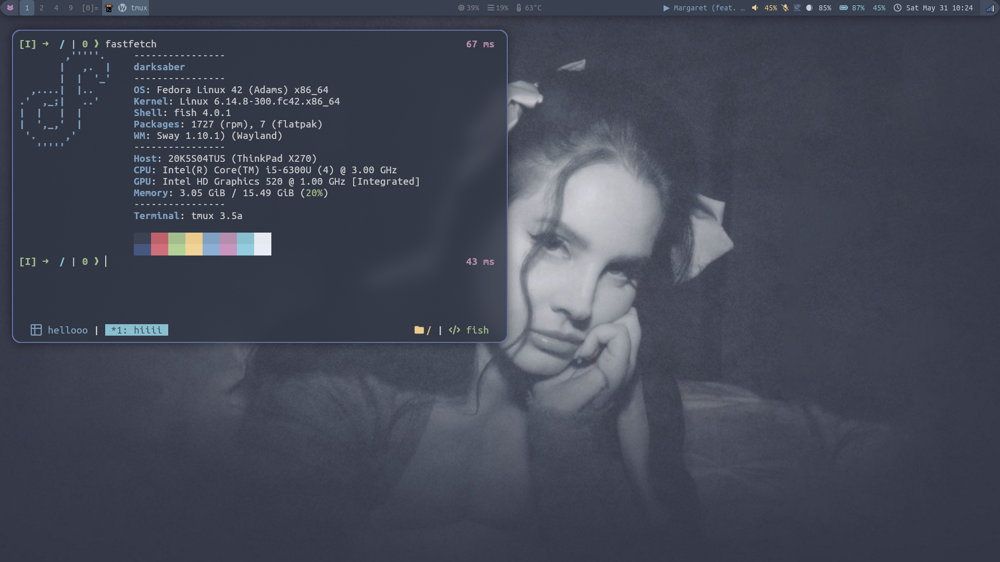

# Haunted Tiles

|  |
| :--:                                                                             |
|                                                  |
| Niri (NixOS)                                                                     |
|                                                  |
| SwayFX (Fedora)                                                                  |

> [!IMPORTANT]
>
> - Check out the `niri` branch for a Nordic-themed Niri configuration.
> - I've recently moved to NixOS and ported all the scripts and configuration in Nix, including [waybar](https://github.com/theopn/nix-conf/blob/main/home-manager/config/waybar.nix) and [swaylock](https://github.com/theopn/nix-conf/blob/main/home-manager/config/swaylock.nix).
>       You can find everything in my [Nix conf repository](https://github.com/theopn/nix-conf).
>       I will sync any major Nix updates to this repository.


Configuration & scripts for my [Dracula](https://draculatheme.com/)-themed (hence the name of the repository) Sway (and i3) environment.

Credits:

- [Logo](./assets/haunted-tiles-logo.png): my girlfriend Naomi
- Wallpaper (Niri): [Nordic wallpapers](https://github.com/linuxdotexe/nordic-wallpapers)
- Wallpaper (Sway): [Color shifted version](https://www.reddit.com/r/wallpaper/comments/odrqc9/night_city_art_5120x2880/) of ["The Neon Shallows" by kawitt](https://www.reddit.com/r/wallpapers/comments/ib6diq/the_neon_shallows/)
- Font: [ProggyClean Nerd Font](https://github.com/bluescan/proggyfonts)

## Sway Installation

1. I typically install Fedora KDE and install Sway on top of it
    ```sh
    sudo dnf install rofi waybar dunst
    # If you install regular Sway instead of Swayfx,
    # make sure to comment out `include ~/.config/sway/swayfx.conf` in the sway config
    sudo dnf copr enable swayfx/swayfx
    sudo dnf install --allowerasing swayfx

    # Necessary packages for system control
    sudo dnf install brightnessctl copyq grimshot pavucontrol playerctl wf-recorder
    # If you don't have Polkit installed, install one
    sudo dnf install lxpolkit

    # Great tools to have for any tiling WM environment
    sudo dnf install blueman network-manager-applet

    # For generating lockscreen image
    sudo dnf install ImageMagick

    # Or your preferred terminal emulator; change $mod+ret in Sway config
    sudo dnf install kitty
    ```
    - If you installed Fedora Sway spin or did `dnf groupinstall`, reference [this](https://gitlab.com/fedora/sigs/sway/sway-config-fedora/-/blob/fedora/sway-config-fedora.spec.rpkg?ref_type=heads) for the complete list of pre-installed packages
2. Install ProggyClean Nerd Font:
    ```sh
    mkdir -p ~/.local/share/fonts && cd ~/.local/share/fonts
    # TODO: Check that this link is up-to-date before you proceed
    wget -O tmp.zip https://github.com/ryanoasis/nerd-fonts/releases/download/v3.4.0/ProggyClean.zip
    unzip tmp.zip && rm tmp.zip
    fc-cache -vf
    cd -
    ```
3. Clone the repository and run the installation script (creates symlink for configuration files and scripts):
    ```sh
    git clone https://github.com/theopn/haunted-tiles.git ~/.config/haunted-tiles
    ~/.config/haunted-tiles/install.sh
    ```
4. Locate your choice of wallpaper (PNG) as `$XDG_CONFIG_HOME/wallpaper.png`
5. Set wallpaper and generate a blurred lock screen image using the included set-wallpaper command (requires ImageMagick and Nerd Font):
    ```sh
    set-wallpaper.sh /path/to/wallpaper
    ```
6. Add yourself to the `input` user group for Waybar keyboard state module:
    ```sh
    sudo usermod -a -G input $(whoami)
    ```

For more tips on configuring i3/Sway, read my [i3-sway-tips repository](https://github.com/theopn/i3-sway-tips).

## i3

Read [this](./x11/readme.md)

## Usage

List of keybindings different from the default i3/Sway:

- `jkl;` -> `hjkl`
- `$mod + h` -> `$mod + z`: toggles hori[z]ontal split
- `$mod + d`: ~app launcher~ -> launches Rofi window switcher
- `$mod + Space`: ~toggles between floating/tiled windows~ -> launches Rofi drun
- `$mod + b`: toggles between floating/tiled windows
- `$mod + [/]`: moves the current workspace to the monitor to the left/right
- `$mod + Shift + c/e`:  toggles the `sway_mode`, from which you can choose to reload the config, restart, or exit Sway
- `$mod + Shift + m`: toggles `monitor_mode`, which you can control outputs
- `$mod + Shift + v`: launches `copoyq show`
- `Print`: launches a Rofi menu with screenshot options using Grimshot (area, screen, window, color picker, etc.)
- `Shift+Print`: launches a Rofi script with screen recording menu using `wf-recorder`
- `$mod + Shift + p`: launches a Rofi script with power options (lock, suspend, shutdown, etc.)

Notes:

1. `Window logo [3]` indicator in Waybar means that there are 3 windows in the scratchpad.
2. You can add a window to a scratchpad with `$mod + Shift + -` and cycle through the scratchpad with `$mod + -`.
3. The keybindings for i3 is nearly identical, but please read the config

